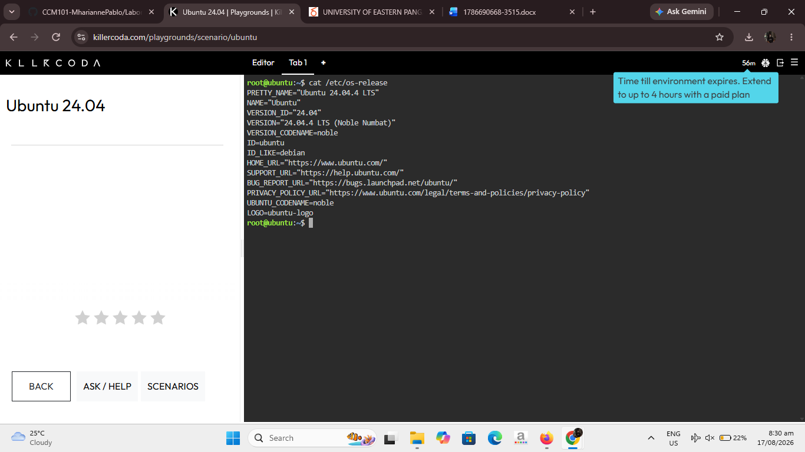

# Laboratory 03 – Multi-Cloud Explorer

## Mission 3: Become a Multi-Cloud Explorer

This laboratory evaluates Amazon Web Services (AWS), Microsoft Azure, and Google Cloud Platform (GCP), compares their major services, recommends providers for different business scenarios, and connects Linux server concepts with cloud virtual machines.

## Checkpoint 1 – Portfolio Structure

Required files:
- `README.md`
- `aws-research.md`
- `azure-research.md`
- `gcp-research.md`
- `cloud-platform-comparison.md`
- `client-recommendations.md`
- `reflection.md`
- `screenshots/`

## Checkpoint 2 – Platform Exploration

### AWS
AWS provides a broad portfolio of cloud services for compute, storage, networking, databases, security, analytics, and application development.

Core services used for this activity:
1. Amazon EC2 – virtual compute
2. Amazon S3 – object storage
3. Amazon VPC – networking
4. AWS IAM – identity and access management

### Microsoft Azure
Azure is Microsoft's public cloud platform and is especially suitable for organizations already using Microsoft technologies.

Core services:
1. Azure Virtual Machines – virtual compute
2. Azure Blob Storage – object storage
3. Azure Virtual Network – networking
4. Microsoft Entra ID – identity management

### Google Cloud Platform
Google Cloud provides infrastructure, data, AI/ML, and container services with strong integration with Kubernetes.

Core services:
1. Compute Engine – virtual compute
2. Cloud Storage – object storage
3. Virtual Private Cloud (VPC) – networking
4. Cloud IAM – identity and access management

## Checkpoint 7 – Linux Investigation

Open a KillerCoda Linux playground and run:

```bash
uname -a
lscpu
free -h
df -h
```

Record the output in your report and capture a screenshot.

### Cloud hosting equivalents

| Requirement | AWS | Azure | GCP |
|---|---|---|---|
| Linux virtual machine | Amazon EC2 | Azure Virtual Machines | Compute Engine |
| Object storage | Amazon S3 | Azure Blob Storage | Cloud Storage |
| Virtual networking | Amazon VPC | Azure Virtual Network | Google Cloud VPC |

### CPU Information


